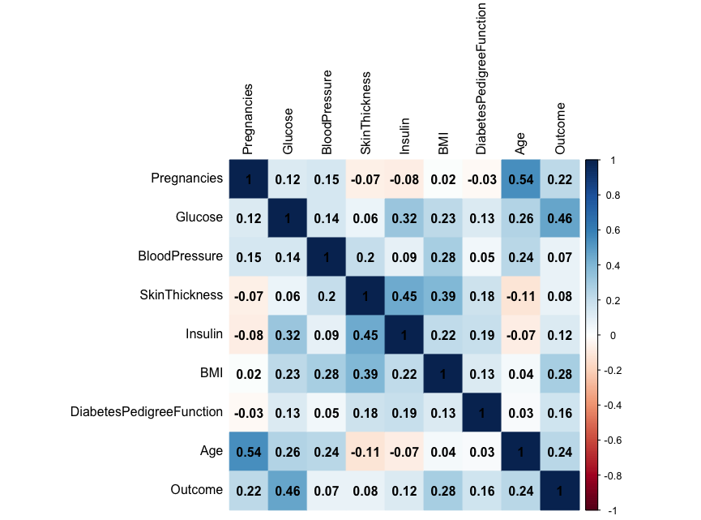
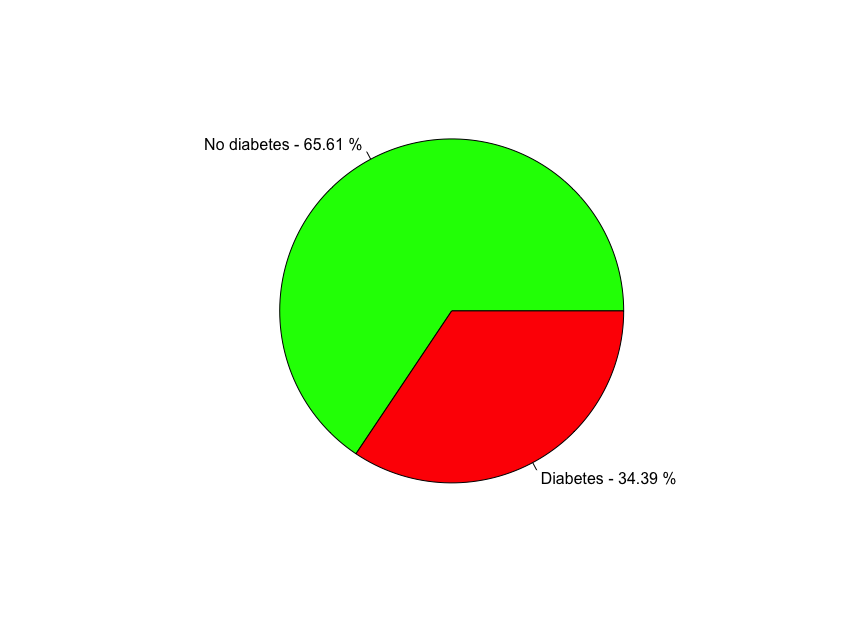

# R repository
Compilation of my R projects

## Project 1: Predictive modeling for Diabetes
This project contains the R code and visualization outputs for a project focused on predicting diabetes using statistical machine learning techniques. 
### Project Overview
- **Objective**: Predict the occurrence of diabetes based on various health indicators.
- **Methods Used**:
  - Data ingestion, cleaning, and preprocessing
  - Exploratory data analysis
  - Building and evaluating a Decision Tree model
  - Building and evluating a Random Forest model
- **Attached files**:
  - 'Healthcare-Diabetes.csv': Contains the original dataset obtained from Kaggle
  - 'Diabetes Indicator Predictive Model.R': Contains the code for data processing, visualizations, and machine learning models
- **Visualizations**:
  <figure>
  
  <figcaption>This is a table showing the correlation coefficients between variables in the dataset.</figcaption>
  </figure>

  <figure>
  
  <figcaption>This is a pie chart showing the distribution of patients that have diabetes vs. no diabetes.</figcaption>
  </figure>

  <figure>
  
  <figcaption>This is a scatterplot showing the distribution of patients' age vs. glucose level.</figcaption>
  </figure>
  
- **Conclusion**:
  -  Summary of findings: TBD
  -  Key takeaways: TBD
